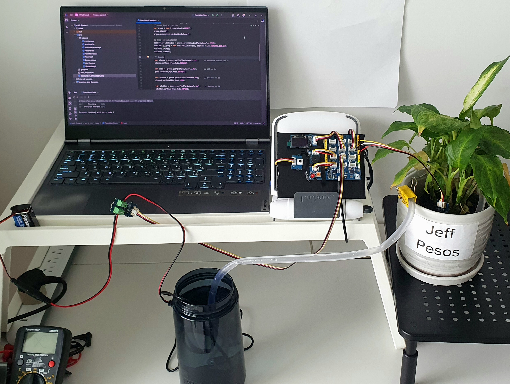
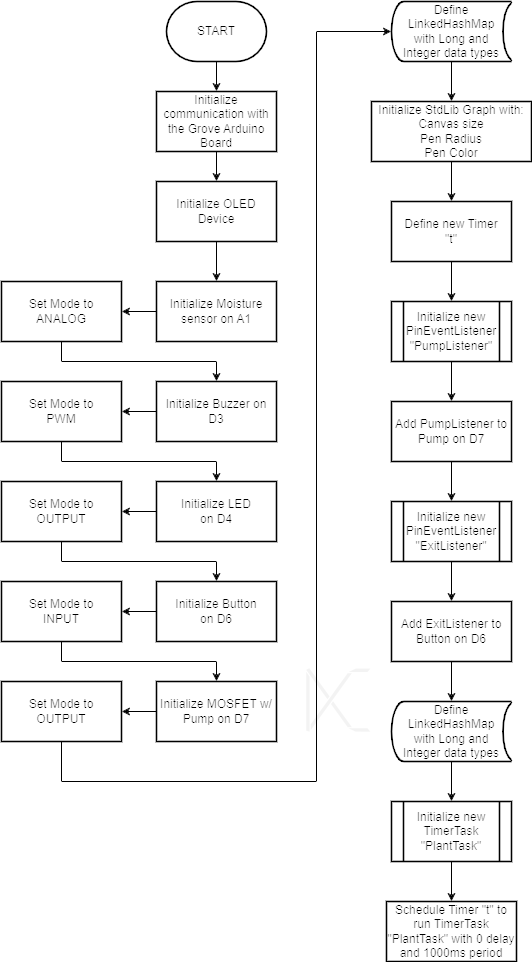
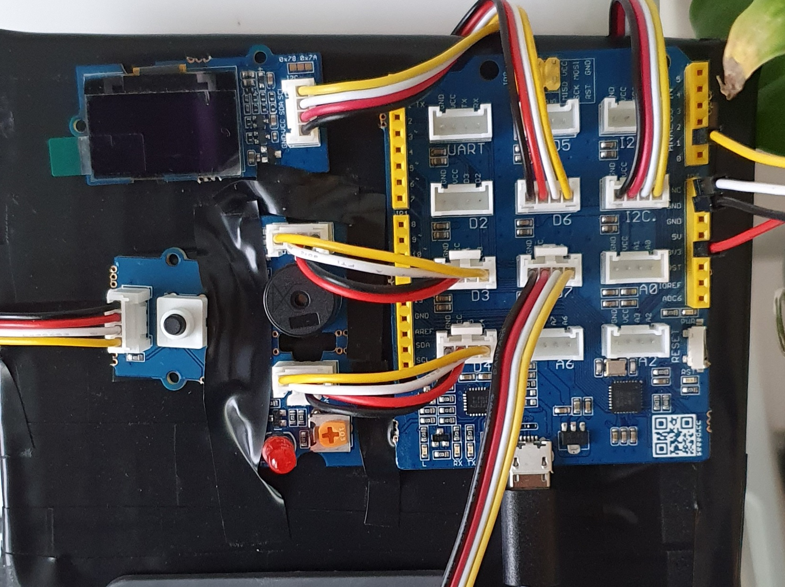
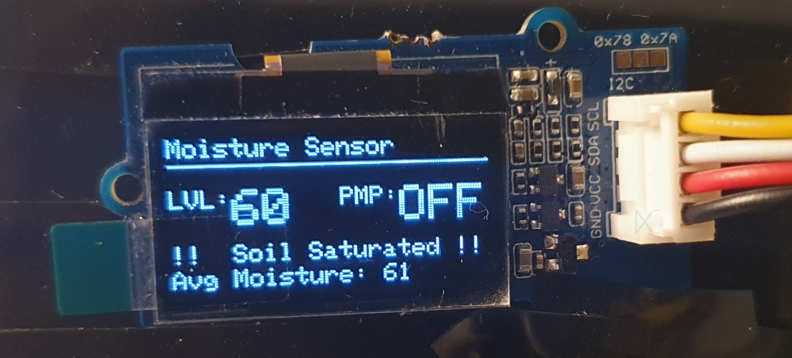
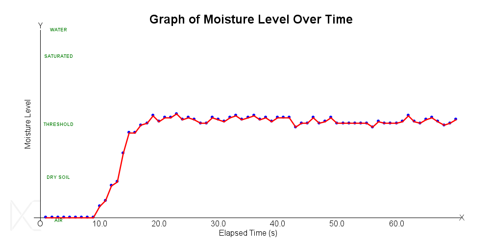

# JAWS | Java Automated Watering System

  

### OBJECTIVE
The Java Automated Watering System (JAWS) project was developed to explore autonomous plant maintenance using sensor-based monitoring and automated watering control. The system is intended for applications where regular human interaction is restricted or impractical, including large-scale vegetation management and environments involving plants that may pose hazardous to humans.

### SUCCESS REQUIREMENTS
1. Autonomously maintain soil moisture within a defined moisture threshold.
2. Provide sufficient real-time feedback for the user to assess system operation, including:
    - A dynamic graph displaying soil moisture over time.
    - The current state of the water pump.
    - The overall average soil moisture level.
3. Provide additional visual and auditory feedback through an LED and buzzer to indicate when the water pump is operating.

### API DESCRIPTIONS & USAGE
1. **Firmata4J** – A java library that allows communication to Arduino boards through the Firmata protocol.
   - The FirmataDevice class (with methods start, stop, and ensureInitializationIsDone) was used to establish communication with the Arduino board.
   - I2CDevice & SSD1306 classes (with methods init, clear, display, getCanvas, drawString, drawHorizontalLine, and setTextsize) were used to initialize & utilize the OLED device on Arduino board.
   - The Pin class (with methods getPin, setMode, Mode, getIndex, getValue, setValue, addEventListener, and removeAllEventListeners) was used to initialize and use peripherals connected to pins on the Arduino board.
   - The PinEventListener interface was used to create the “PumpListener” event, to operate the D4 LED and D3 Buzzer. The state of the pump itself is set by the “PlantTask” TimerTask; the pump is switched ON if the soil moisture drops below the minimum threshold the “PumpListener” event listener then enables the buzzer and LED. Otherwise the pump is switched off, which turns off the buzzer and LED as well.
    Another event listener, “ExitListener”, was created to listen if the D6 Button was pressed, in which case the peripherals are reset, Arduino is disconnected and the program is aborted with output messages.

3. **StdLib** – A java library that implements several libraries including graphical functionality through the StdDraw class.
    - The StdDraw class (with setCanvasSize, setPenRadius, setPenColor, clear, setFont, text, setYscale, line, and setXscale) was used for drawing a dynamic graph of moisture level over time. This was done by first storing the time and processed sensor data (of type Long and Integer respectively) in a LinkedHashMap. This LinkedHashMap was then iterated over in a For-Loop that draws the data points, connecting lines, and 10s markers on the x-axis.

### COMPONENTS USED:
- Laptop with java code
- Seeeduino Lotus (Arduino board)
- Grove SSD1315 0.96” OLED
- Grove Buzzer (on pin D3)
- Grove Red LED (on pin D4)
- Grove Button (on pin D6)
- Grove Capacitive Moisture Sensor (on pin A1)

- Grove MOSFET (on pin D7)
- 9V Battery (connected to MOSFET)
- JOVTOP JT-180A Water Pump (connected to MOSFET)

### SYSTEM DESIGN
Development began with a simple functional implementation in the main jawsMain class. The system was then progressively refined to improve organization, maintainability, responsiveness, and user feedback.
1. The project was packaged as ca.jaws and built into an executable JAR for easier deployment.
2. The codebase was divided into multiple classes to improve organization and readability. Polymorphism was used when implementing the run() and onValueChange() methods in the PlantTask, TimerTask, and PinEventListener classes, while private variables were used to encapsulate internal class state.
3. A public Peripherals class was introduced to provide centralized access to hardware pins and connected devices.
4. Event listeners were implemented in place of continuous polling loops, allowing pump and shutdown events to be handled asynchronously.
5. LED and buzzer indicators were added to provide visual and auditory feedback when the pump activates or deactivates.
6. Additional OLED status messages were added to communicate moisture conditions, average moisture levels, and possible system issues such as insufficient water circulation or sensor-related problems.
7. The dynamic StdDraw graph was improved with clearer y-axis descriptors and additional visual distinctions to improve readability.
8. Minimum and maximum moisture thresholds were introduced to account for measurement variation and reduce rapid switching in the pump state.

### TESTING AND VALIDATION
The system was tested incrementally throughout development by running the program before and after connecting each hardware peripheral to verify operational integrity and isolate potential issues.
Unit testing was also performed using JUnit on the getMoisturePercentage() method, which converts raw moisture-sensor voltage readings into corresponding moisture percentages. The method was tested under three conditions:

1. Experimentally acquired calibration values were verified to ensure that they converted to their expected moisture percentages.
2. Raw input values within the defined sensor range were tested to confirm that the resulting moisture percentages remained within the expected lower and upper bounds.
3. One hundred randomly generated input values were tested to verify that the method consistently produced outputs within the defined moisture-percentage range.
System-level testing was then performed using a dry plant sample. As shown in the Graph of Moisture Level Over Time, the measured moisture level increased after watering and stabilized near the target threshold, demonstrating that the moisture-monitoring and pump-control logic operated as intended.

### CONCLUSION
The JAWS system successfully demonstrated autonomous plant watering using real-time soil-moisture monitoring, event-driven control, and multiple forms of user feedback.

A key limitation of the current design is its dependence on a laptop for Java execution and system monitoring. Future development could migrate the software to a portable platform, such as a Raspberry Pi or similar device, to create a more compact and self-contained implementation.
